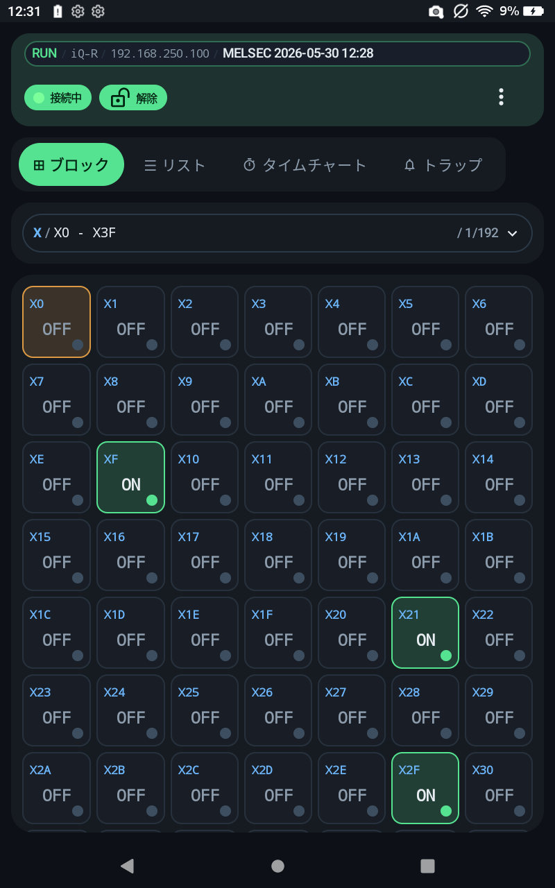
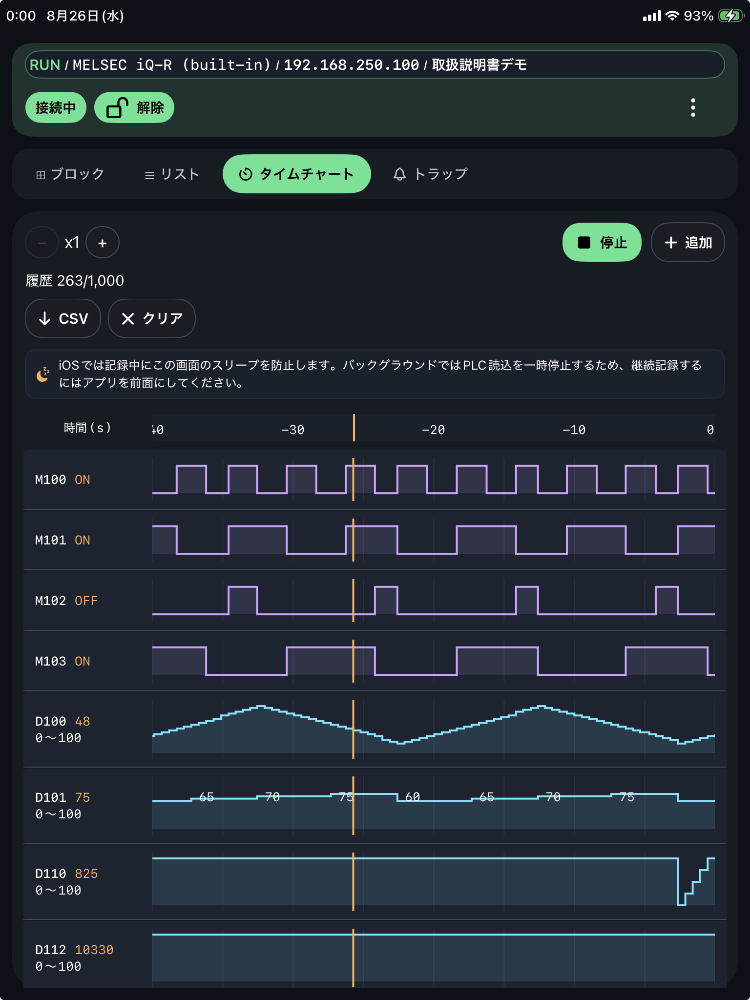
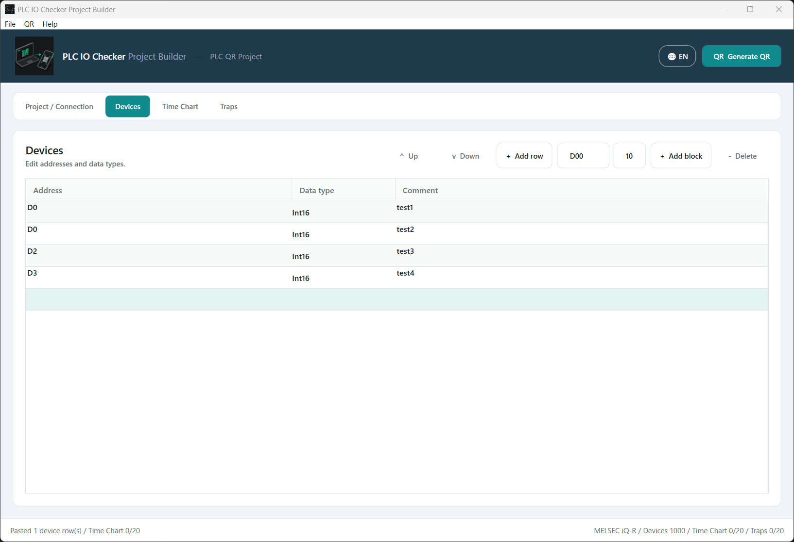

# FA Labo PLC Console Manual Site

[](https://github.com/fa-yoshinobu/PlcIoChecker_Site/actions/workflows/pages.yml)

FA Labo PLC Console の公開マニュアルサイトです。Android / iOS アプリの基本操作、PLC 接続設定、監視・書込・記録機能、PC 用 `PlcIoChecker_ProjectBuilder` の使い方を HTML ページとして管理しています。

- Public site: <https://fa-yoshinobu.github.io/PlcIoChecker_Site/>
- Privacy policy: <https://fa-yoshinobu.github.io/PlcIoChecker_Site/reference/privacy-policy.html>
- ProjectBuilder: <https://github.com/fa-yoshinobu/PlcIoChecker_ProjectBuilder>

ProjectBuilder の exe は、[`PlcIoChecker_ProjectBuilder` の Releases](https://github.com/fa-yoshinobu/PlcIoChecker_ProjectBuilder/releases) にある Assets から `PlcIoCheckerProjectBuilder-win-x64.zip` をダウンロードして使用します。

## スクリーンショット

| 監視 | タイムチャート | QR / JSON |
| --- | --- | --- |
|  |  |  |

| ProjectBuilder |
| --- |
|  |

## このサイトで扱うこと

| 入口 | 内容 |
| --- | --- |
| [`index.html`](index.html) | マニュアルの目次トップ |
| [`start/`](start/) | 入手・インストール、はじめる |
| [`plc/`](plc/) | PLC 接続、MELSEC / KEYENCE 設定、機種別の接続設定例 |
| [`monitoring/`](monitoring/) | 監視、List 登録編集、書込、CPU操作、コメント、タイムチャート、トラップ |
| [`transfer/`](transfer/) | QR / JSON、プロジェクトJSON |
| [`settings/`](settings/) | メニュー、アプリ設定、ライセンス |
| [`projectbuilder/`](projectbuilder/) | ProjectBuilder、デバイス入力、QR 生成 |
| [`reference/`](reference/) | サポート、公開情報、用語集、リリースノート、困ったとき |

## ローカル確認

静的ファイルだけで動作するため、ブラウザで [`index.html`](index.html) を開けば確認できます。

macOS の terminal から公開サイトを開く場合:

```bash
open https://fa-yoshinobu.github.io/PlcIoChecker_Site/
```

Windows PowerShell からローカル確認する場合:

```powershell
Start-Process .\index.html
```

## メンテナ向け資料

メンテナ向けの編集ルール、ディレクトリ構成、GitHub Pages 運用は [`docs/MAINTENANCE.md`](docs/MAINTENANCE.md) に分けています。

- [`TODO.md`](TODO.md): ページ作成状態と更新チェックリスト
- [`docs/DEVELOPMENT_HISTORY.md`](docs/DEVELOPMENT_HISTORY.md): 開発・保守作業の履歴
- [`.github/STORE_RELEASE_CHECKLIST.md`](.github/STORE_RELEASE_CHECKLIST.md): Store 公開時の内部チェック

## 関連リポジトリ

- Manual site: <https://github.com/fa-yoshinobu/PlcIoChecker_Site>
- ProjectBuilder: <https://github.com/fa-yoshinobu/PlcIoChecker_ProjectBuilder>
